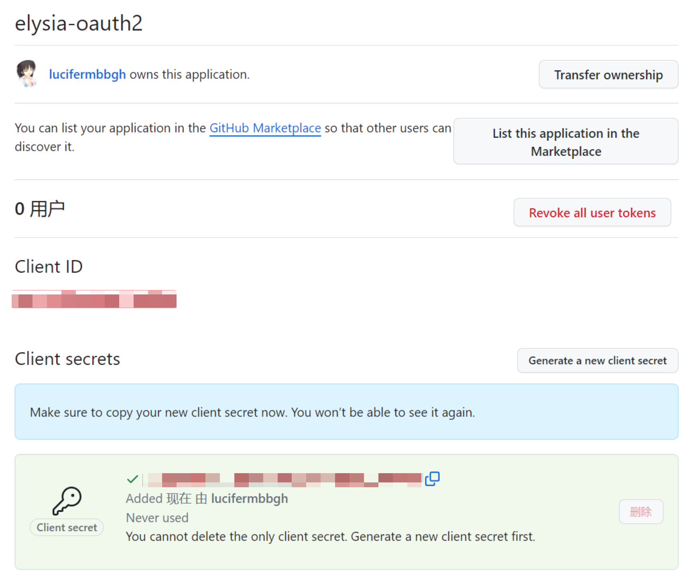

# Elysia：spring-security + OAuth2学习项目

## 项目简介
<p>基于spring-boot 3.2.2版本的微服务项目，主要是学习spring-security + OAuth2.0安全框架</p>
<p>通过spring-security + OAuth2安全框架，创建elysia项目工程的公共登录验证门户</p>
<p>项目名：elysia-gate</p>
<p>主要实现功能：</p>
<ul>
<li>用户注册服务</li>
<li>用户登录服务</li>
<li>用户角色/授权服务</li>
<li>用户信息管理服务</li>
<li>用户鉴权服务</li>
</ul>

## OAuth2.0样例
<p>这里使用GitHub的OAuth Apps功能，实现用户授权第三方登录功能。</p>
<p>1、注册GitHub OAuth Apps</p>

<p>2、配置OAuth Apps</p>


<p>3、注册完成后获取ClientId和ClientSecret</p>
Client Id：9076ecee0a2ffe938b53
Client secrets：9e3339b7e56baea091deb19f41b14d7903b0b27d


## 项目结构
```
.
├── README.md
├── elysia-gate
```

### 已整合：
```
jdk 17
spring 6
spring-boot 3.2.2
spring-security 6.2.1
thymeleaf 3.1.2.RELEASE
spring-cloud-alibaba-nacos-discovery
spring-cloud-alibaba-nacos-config
spring-cloud-alibaba-sentinel
spring-cloud-alibaba-seata
spring-cloud-ribbon
spring-cloud-openFeign
spring-cloud-gateway
rocketmq
redis
```

### 未整合：
```
……
```

### 部署方式：
```
docker-compose
```

### 未来计划：
```
oauth2
```